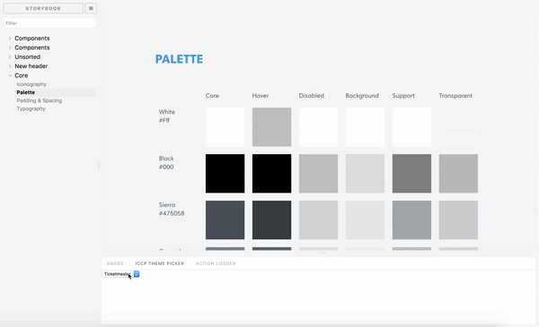

# storybook-styled-components

**DEPRECATED!**

This plugin has issues when used with Storybook v5 and beyond, and there's a better option available at:
https://github.com/echoulen/storybook-addon-styled-component-theme



_Switch between themes and see how your components react_

## Set It Up

inside your storybook addons, register the `storybook-styled-components`:

```javascript
// addons.js
import "storybook-styled-components/register";
```

In your config.js, define your theme configuration and pass it in to the `addDecorator` function

```javascript
// config.js
import { configure, addDecorator } from "@storybook/react";
import { withThemes } from "storybook-styled-components";

// then import your themes
import firstTheme from "./src/themes/first";
import secondTheme from "./src/themes/second";

const themes = {
  "First Theme": firstTheme,
  "Second Theme": secondTheme
};

// now add the decorator
addDecorator(withThemes(themes));
// done!
```

**This is still a Work In Progress ... Feedback welcomed**

[Read The License](./license.md)
